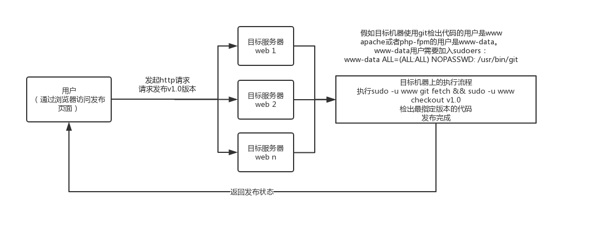

# Deployer
一个使用git的简易项目发布工具

## 发布流程说明


## 目录说明
```
.
├── LICENSE
├── README.md
├── config			#配置文件目录
│   ├── app.local.php		#本地配置文件 这个文件会覆盖app.php的内容
│   └── app.php				#示例配置文件
├── deployer		#部署机器web目录
│   └── index.php			#部署机器web入口文件
├── generate_password.php	#一个命令行下生成密码的工具
├── runtime			
│   └── logs		#临时文件日志目录
└── server			#目标机器机器web目录
    └── index.php			#目标机器机器web入口文件
```

## 配置步骤
1. 添加php脚本的执行用户到sudoers中

比如你的Apache或者php-fpm服务的用户是www-data
```
visudo
--------------------------------
...
#Defaults   !visiblepw   #注释掉这句 这句是限制sudo只能在命令行执行的
www-data ALL=(ALL:ALL) NOPASSWD: /usr/bin/git
```

2. 修改config

3. 分别配置好部署机器和目标机器的web服务

4. 访问部署机器的web站点，输入git tag版本号发布吧~


