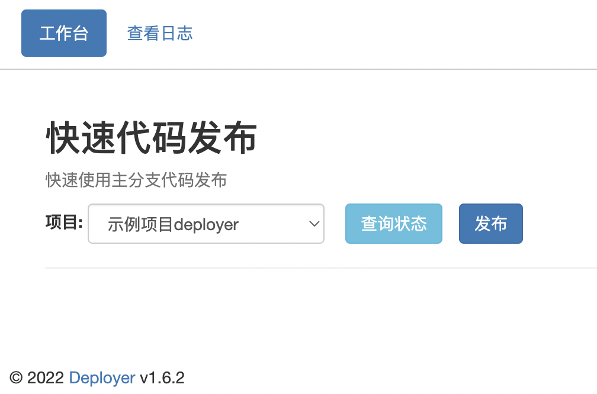

# Deployer
一个使用git的简易项目发布工具



## 安装配置

### 安装依赖库
```sh
npm install
composer install
```

### 初始化
```sh
php deployer init
```

### 创建管理员
```sh
php deployer user:add
```

### 配置服务
使用php-fpm/nginx组合，nginx项目配置文件示例：[deployer.conf](docs/deployer.conf)

至此配置完毕，打开浏览器访问: http://您的发布机器ip:8090/ 愉快的使用吧~


