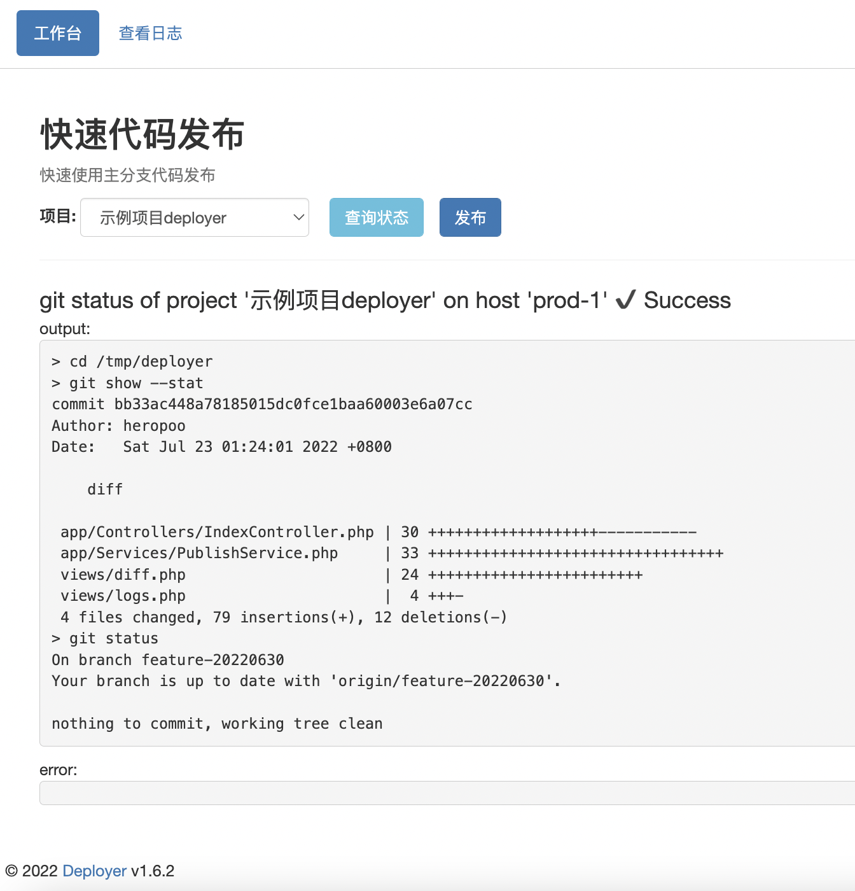

# Deployer
一个使用git的简易项目发布工具



## 安装配置

### 安装依赖库
```sh
composer install
```

### 初始化&创建用户
```sh
php deployer user:add
```

### 配置服务
使用php-fpm/nginx组合，nginx项目配置文件示例：[deployer.conf](docs/deployer.conf)

### 配置ssh登录私钥
```php
<?php
// 修改 config/deployer.local.php
return [
    // ...
    'private_key' => '私钥内容',
    // ...
];
```

### 配置目标机器
```php
<?php
// 修改 config/hosts.local.php
return [
    //...
    'prod-1' => [
        'name' => '目标机器1', // 目标机器名称
        'host' => '172.1.1.1', // 目标机器ip，推荐内网ip
        'port' => 22, // 目标机器端口
        'user' => 'www', // 目标机器用户，推荐非root用户
    ],
    //...
];
```

### 配置发布项目
```php
<?php
// 修改 config/projects.local.php
return [
    //...
    'project-1' => [
        'name' => '示例项目1',
        'path' => '/path/to/project1', // 项目在目标机器上的路径
        'branch' => 'master', // 项目发布分支
        'hosts' => [ //目标机器列表
            'prod-1' // 目标机器id, 可以是多台机器
        ]
    ],
    //...
];
```

至此配置完毕，打开浏览器访问: http://您的发布机器ip:8090/ 愉快的使用吧~


